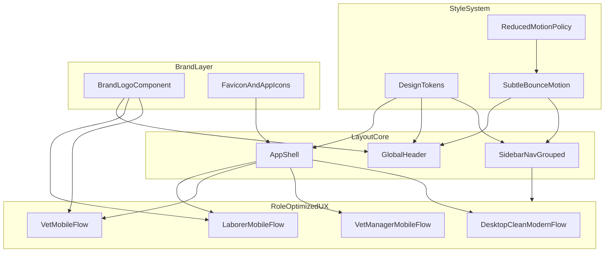

# Modern UI Overhaul Implementation Plan

## Outcomes
- Cleaner information hierarchy: top-left identity area simplified and structured.
- Navigation grouped into clear sections (no endless list feeling).
- Consistent modern emerald/cyan visual system across all pages.
- Subtle bouncy interaction feedback with accessibility-safe reduced-motion behavior.
- Mobile-first optimization for laborer, vet, and vet_manager workflows.
- Logo replacement everywhere, including favicon and app identity surfaces.

## Codebase Areas To Update
- Layout shell and global identity: [web/src/components/layout/AppShell.tsx](/home/george/Documents/Dev projects/Farm Manager/web/src/components/layout/AppShell.tsx), [web/src/components/layout/GlobalHeader.tsx](/home/george/Documents/Dev projects/Farm Manager/web/src/components/layout/GlobalHeader.tsx), [web/src/components/layout/SidebarNav.tsx](/home/george/Documents/Dev projects/Farm Manager/web/src/components/layout/SidebarNav.tsx)
- Brand asset component: [web/src/components/BrandLogo.tsx](/home/george/Documents/Dev projects/Farm Manager/web/src/components/BrandLogo.tsx)
- Global styles/tokens/motion: [web/src/index.css](/home/george/Documents/Dev projects/Farm Manager/web/src/index.css)
- Routes and page-level grouping impact: [web/src/App.tsx](/home/george/Documents/Dev projects/Farm Manager/web/src/App.tsx)
- Auth-facing pages where logo/visual hierarchy appears: [web/src/pages/LoginPage.tsx](/home/george/Documents/Dev projects/Farm Manager/web/src/pages/LoginPage.tsx), [web/src/pages/UnauthorizedPage.tsx](/home/george/Documents/Dev projects/Farm Manager/web/src/pages/UnauthorizedPage.tsx)
- Dashboard and high-traffic farm pages for mobile/desktop polish (laborer/vet/management + core farm pages under `web/src/pages`)
- Static branding files (favicon/icon references) in the web app public/static assets and HTML entry.

## Implementation Tracks

### 1) Design Tokens and Motion Foundation
- Introduce a refined emerald-modern token set (primary, secondary, surface, text, border, status colors) in [web/src/index.css](/home/george/Documents/Dev projects/Farm Manager/web/src/index.css).
- Standardize component-level shadows, radius, spacing density, and focus rings to one system.
- Replace current press-scale behavior with subtle spring-like active feedback using CSS transforms + easing.
- Add reduced-motion guard:
  - Honor `prefers-reduced-motion` and disable bounce/entry animation where appropriate.

### 2) Header Clarity (Top-left cleanup)
- Refactor [web/src/components/layout/GlobalHeader.tsx](/home/george/Documents/Dev projects/Farm Manager/web/src/components/layout/GlobalHeader.tsx) into clear zones:
  - Brand cluster (logo + app name)
  - User identity cluster (name + role)
  - Action cluster (workspace switch, language, home, sign out)
- Remove visual crowding by reducing redundant badges and introducing consistent priority order.
- Ensure small-screen wrapping behaves predictably (no cramped controls).

### 3) Navigation Grouping (No endless list)
- Refactor [web/src/components/layout/SidebarNav.tsx](/home/george/Documents/Dev projects/Farm Manager/web/src/components/layout/SidebarNav.tsx) into grouped sections:
  - Core operations
  - Clinical & flock control
  - Workforce & admin
- Add collapsible section headers for desktop and a compact grouped drawer behavior for mobile.
- Keep role-based visibility but present grouped mental model first.

### 4) Branding Replacement Everywhere
- Update [web/src/components/BrandLogo.tsx](/home/george/Documents/Dev projects/Farm Manager/web/src/components/BrandLogo.tsx) to use the attached logo asset.
- Replace logo references in header/auth/error pages.
- Update favicon/app icon references in entry/static files so browser tab and install surfaces match.
- Run a global logo usage sweep to ensure no old logo remains.

### 5) Mobile Optimization (Laborer, Vet, Vet Manager)
- Prioritize mobile ergonomics in:
  - laborer dashboard and field pages,
  - vet clinical flows,
  - vet_manager action pages.
- Enforce touch-friendly controls (44px+ targets), sticky primary actions where needed, and condensed cards for glanceable status.
- Remove horizontal overflow risks and improve scan order for operational tasks.

### 6) Desktop Modernization Across App
- Apply card/table/header styling consistency across dashboards and major pages.
- Normalize page titles, subtitles, action rows, and section separators.
- Improve contrast and whitespace rhythm so information feels “clear, not scattered”.

## Delivery Sequence
1. Establish token/motion system in global styles.
2. Refactor header + sidebar grouping architecture.
3. Replace brand assets globally (including favicon/icon).
4. Apply mobile-first polish to laborer/vet/vet_manager key pages.
5. Apply desktop consistency pass across remaining app surfaces.
6. Run full visual QA and regressions.

## Validation
- Build and typecheck: web build succeeds.
- Responsive checks at common breakpoints (small phones, tablets, desktop).
- Role walkthroughs:
  - laborer mobile task flow,
  - vet clinical flow,
  - vet_manager approval/scheduling flow,
  - manager desktop command flow.
- Accessibility checks:
  - focus visibility,
  - contrast on key states,
  - reduced-motion behavior.
- Branding check: old logo eliminated and favicon/icon updated.

## UI Architecture Diagram
